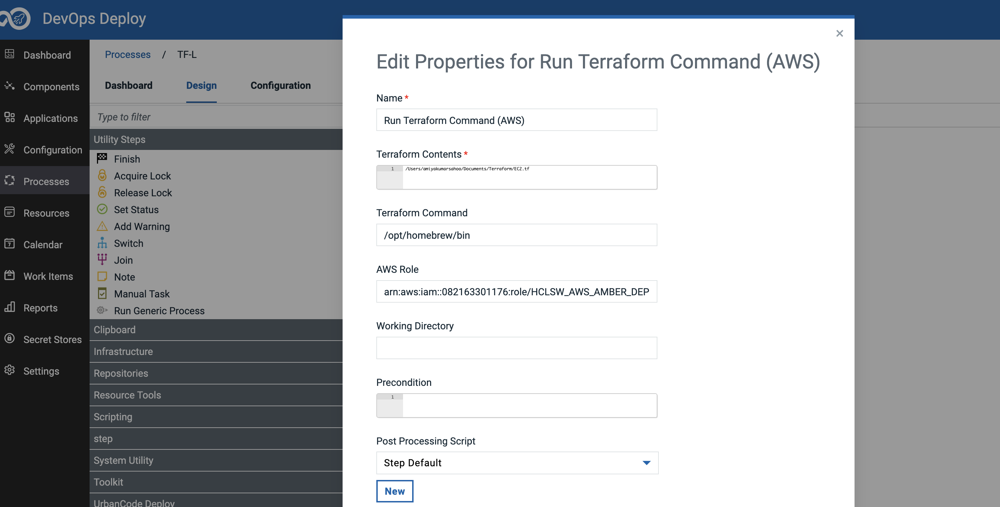
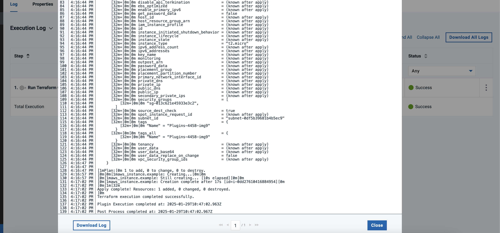

# Usage

---
You can use the Terraform plug-in to execute any terraform script related to the AWS cloud services.


### **Example:**

You can use this plug-in to create an EC2 instance.

You can have a terraform script as below that has all the specifications to create an EC2 instance in a file named EC2.tf.

```
provider "aws" {
region = "us-east-1"
}

resource "aws_instance" "example" {
ami           = "ami-01816d07b1128cd2d"
instance_type = "t2.micro"
subnet_id     = "subnet-id*******"

tags = {
Name = "instance-name-xyz"
}

associate_public_ip_address = false
security_groups = ["sg-id******"]
}
```
You need to provide the full path of the script as shown in the image below.

You need to provide the path of the Terraform executable command and the AWS role that is needed to assume.




Once the plugin step is run it will automatically assume the AWS role and run the essential Terraform commands 
which are **_"terraform init"_** and **_"terraform apply "-auto-approve"_** to launch an ec2 instance.



You can verify if the EC2 instance got created in the AWS console by searching the Tag name **_"instance-name-xyz"_**.


